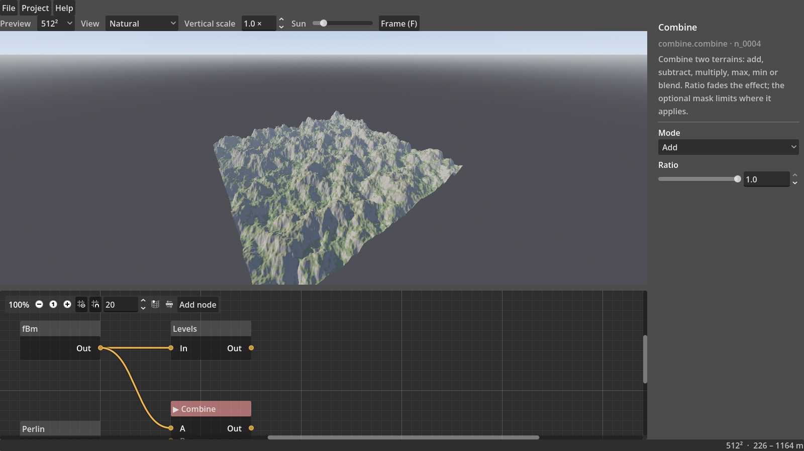

# OpenTerrainStudio

**A free, open-source, node-based terrain authoring application.**

Build a landscape in a node graph, shape it with noise, erosion and water simulation, colour it, grow vegetation on it, preview it live in 3D, then export heightmaps, masks, colour maps, meshes and vegetation data into Unreal Engine, Blender, Godot or any other tool.

OpenTerrainStudio is built with a Rust terrain engine and a Godot 4 editor, and is developed by **EllisonDigital**.

> **Status: pre-alpha (v0.1).** The foundation works end to end: node graph, live 3D preview, save/load and EXR/PNG export, packaged for Windows, macOS and Linux. See the [roadmap](docs/ROADMAP.md) for what's next.



---

## Planned features

- **Node graph workflow**: primitives, noise, terrain shapes, filters and masks, with any node output previewable and exportable.
- **Erosion and hydrology**: hydraulic and thermal erosion, rivers, lakes, sea and snow, with flow, wear and deposition maps.
- **Colour tab**: a dedicated graph for colouring the terrain and producing splat/weight maps.
- **Vegetation**: Trees, Shrubs and Grass populations that react to slope, height, water and each other, exported as density masks and point data.
- **Resolution independence**: preview fast at low resolution, build at up to 16K and beyond with the same result.
- **GPU acceleration**, with a full CPU fallback for older hardware.
- **Engine-ready export**: EXR, 16-bit PNG, RAW, GLB, OBJ and CSV/JSON, with presets for Unreal, Godot and Blender.

## Download

Builds for Windows, macOS and Linux are attached to each release on the
[Releases page](https://gitlab.com/ellison-digital/open-terrain-studio/open-terrain-studio/-/releases).
Download the zip for your system, unzip it and run OpenTerrainStudio. Nothing else needs installing.

| System | Download | Notes |
| --- | --- | --- |
| Windows 10/11 (x86_64) | `OpenTerrainStudio-<version>-windows-x86_64.zip` | Keep `terrain_godot.dll` next to the `.exe`. The build isn't signed yet, so SmartScreen may warn: choose *More info → Run anyway*. |
| macOS 11+ (Apple Silicon and Intel) | `OpenTerrainStudio-<version>-macos-universal.zip` | Not notarised yet: right-click `OpenTerrainStudio.app` → *Open* the first time, or run `xattr -dr com.apple.quarantine OpenTerrainStudio.app`. |
| Linux (x86_64) | `OpenTerrainStudio-<version>-linux-x86_64.zip` | Keep `libterrain_godot.so` next to `OpenTerrainStudio.x86_64`. Needs Vulkan drivers. |

To use exported heightmaps in Blender, Unreal Engine or Godot, see the [export guides](docs/export-guides.md).

## Documentation

- [Export guides](docs/export-guides.md): importing heightmaps into Blender, Unreal Engine and Godot at the right scale.
- [Architecture](docs/ARCHITECTURE.md): how the application and terrain engine are designed.
- [Roadmap](docs/ROADMAP.md): milestones from v0.1 to v1.0, risks and decisions.

## Building from source

You need:

- [Rust](https://rustup.rs) 1.94 or newer (stable)
- [Godot](https://godotengine.org/download) 4.6 or newer (the standard build, not .NET)

```sh
git clone https://gitlab.com/ellison-digital/open-terrain-studio/open-terrain-studio.git
cd open-terrain-studio
cargo build          # builds the Rust terrain engine and the Godot extension
godot --path app     # runs the app
```

`godot` is whatever you called the Godot executable. You can also open `app/project.godot` in the Godot
editor and press Play. After changing Rust code, run `cargo build` again and restart the app.

### Packaging the app

Packaged builds use Godot's export templates, which must match the Godot version exactly. That version
is pinned in [`.godot-version`](.godot-version) (currently 4.7.2) and CI uses the same file.

```sh
scripts/fetch-godot.sh --templates             # Linux: downloads that Godot and its export templates
GODOT=.godot-cache/4.7.2/godot scripts/package.sh
```

`scripts/package.sh` builds the release library, copies it into `app/bin/` (release builds load it from
there, development builds from `target/debug`), exports the app and zips it into `build/`. It packages
the current OS by default. Godot can export all three from Linux, given each OS's library in a folder:
`LIB_DIR=dist scripts/package.sh linux windows macos`. On Windows, use `scripts\package.ps1`. On other
systems, install the templates from the Godot editor (*Editor → Manage Export Templates*).

Pushing a `v*` tag makes CI build the library on all three OSes, export the apps and publish a GitLab
Release; see [`.gitlab-ci.yml`](.gitlab-ci.yml).

### Using the app (v0.1)

- **Right-click the graph** (or press *Add node*) to add nodes. Drag from an output to an input to connect.
- **Click a node** to preview it in 3D and edit its settings on the right. Click empty space for world settings.
- **Viewport:** drag to orbit, Shift-drag or middle-drag to pan, scroll to zoom, <kbd>F</kbd> to frame.
- **File → Export Viewed Node** writes a 32-bit EXR (heights in metres) and/or a 16-bit PNG (0–65535 = the
  world height range), plus a `build.json` with the world size, height range and Unreal import values.

v0.1 nodes: Constant, Perlin, Simplex, fBm, Combine, Levels.

### Tests

```sh
cargo test --workspace
godot --headless --path app --script res://tests/smoke_test.gd
godot --path app --script res://tests/ui_test.gd        # needs a display (or xvfb-run) and a GPU
```

## Contributing

Contributions are welcome; see [CONTRIBUTING.md](CONTRIBUTING.md), including how to add a node (pure Rust, no UI code). Issues and merge requests are handled on GitLab:
`gitlab.com/ellison-digital/open-terrain-studio/open-terrain-studio`

Every commit must be signed off under the [Developer Certificate of Origin](https://developercertificate.org/). Use `git commit -s` to add the `Signed-off-by:` line.

## License

Licensed under either of

- Apache License, Version 2.0 ([LICENSE-APACHE](LICENSE-APACHE))
- MIT license ([LICENSE-MIT](LICENSE-MIT))

at your option.

Unless you explicitly state otherwise, any contribution intentionally submitted for inclusion in the work by you, as defined in the Apache-2.0 license, shall be dual licensed as above, without any additional terms or conditions.

## Trademark

The source code is open, but the name "OpenTerrainStudio" and its logo belong to EllisonDigital. You are welcome to fork the project, but please release forks under a different name.

OpenTerrainStudio is an independent project and is not affiliated with QuadSpinner or Gaea.
