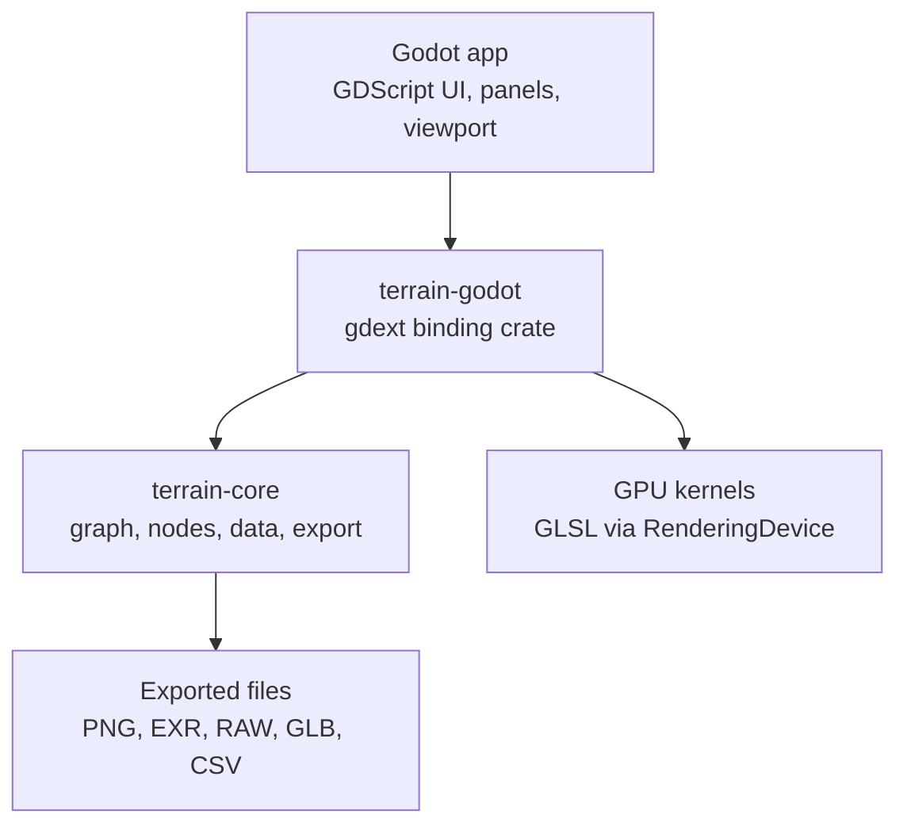

# OpenTerrainStudio — Architecture

OpenTerrainStudio is an open-source project by **EllisonDigital**.
Repository: `gitlab.com/EllisonDigital/open-terrain-studio/open-terrain-studio`

This document describes the technical architecture. The milestone plan lives in [ROADMAP.md](ROADMAP.md).

---

## 1. Overview

OpenTerrainStudio is a free, open-source, node-based terrain authoring application with a Gaea-like workflow: build a terrain in a node graph, preview it live in 3D, then export heightmaps, masks, vegetation data and meshes into Unreal, Blender, Godot or any other tool.

**Scope for v1.0**

- Standalone desktop app (Windows, Linux, macOS) built on Godot, with all terrain logic in a Rust library.
- Node graph with primitives, noise, filters, erosion, hydrology, masks, colour and vegetation (Trees / Shrubs style) nodes.
- Resolution-independent graphs: fast low-res preview, identical-looking high-res build.
- Export of any node output as heightmaps, masks, colour maps, normal maps, meshes and point data.

**Non-goals (for now)**

- No headless CLI, no Unreal/Blender plugins. Integration is by exported files. A CLI can be added later because the core has no Godot dependency.
- Not a game-engine terrain system. The app authors data; engines render it.
- Not a clone of Gaea. Same workflow ideas, independent implementation from published research.

**Guiding principles**

1. **Core owns the data and the graph.** Godot is the view and editor; it never holds the source of truth.
2. **World units everywhere.** Parameters are metres and physical quantities, never pixels or iteration counts.
3. **Deterministic.** Same graph + same seed = same result (bit-identical on CPU, within tolerance on GPU).
4. **CPU reference first, GPU second.** Every algorithm ships a CPU version that tests and GPU versions are measured against.
5. **Every output is exportable.** Any port on any node can be marked for export.
6. **Small, working increments.** Each milestone ends with a usable, releasable app.

---

## 2. Technology decisions

The stack is Rust for all terrain logic, Godot 4 for the application, and Godot's RenderingDevice for GPU compute.

| Area | Choice | Why |
| --- | --- | --- |
| Terrain engine | Rust library (`terrain-core`) | Memory safety for heavy array code, Rayon multithreading, `cargo` builds on every OS |
| Application | Godot 4.x (Forward+ renderer) | UI toolkit, docking panels, GraphEdit, PBR renderer, MultiMesh instancing, packaging |
| Rust ↔ Godot | godot-rust (`gdext`), version pinned | Actively maintained community bindings for GDExtension; pre-1.0, so pin the version |
| UI scripting | GDScript | Fast iteration on panels and editor glue; heavy logic stays in Rust |
| GPU compute | Godot RenderingDevice + GLSL compute shaders | Results stay on Godot's GPU, no copies for preview |
| CPU parallelism | Rayon | Row/tile-parallel loops with no data races |
| Image I/O | `image` crate (PNG 8/16-bit), `exr` crate (32-bit float) | Pure Rust, no system dependencies |
| Serialisation | `serde` + JSON (project), YAML optional for presets | Human-readable, diffable |
| Mesh export | `gltf` crate (GLB), hand-written OBJ | GLB for engines, OBJ for universal fallback |

**Decided against (for now):** wgpu (only needed if a GPU-accelerated CLI is wanted), C++ core, C# scripting (adds a .NET dependency to the build), Compatibility renderer as the main target (it has no compute shaders, so it is only the CPU-compute fallback for old hardware).

**Hardware support:** GPUs with Vulkan 1.2, D3D12 or Metal use the Forward+ renderer with GPU compute. Older hardware is also supported: the app runs on Godot's Compatibility (OpenGL) renderer and every node uses its CPU implementation. Same features and results, just slower. Official minimum GPU and RAM figures will be set from benchmarks during v0.4–v0.8.

---

## 3. System architecture

The system is four layers: a pure-Rust core, a thin Godot binding, GPU kernels, and the Godot application.



The UI talks only to the binding; the binding owns the core graph and dispatches GPU work; the core writes exports.

**Cargo workspace crates**

| Crate | Depends on Godot? | Responsibility |
| --- | --- | --- |
| `terrain-core` | No | Heightfield types, node trait, graph model, evaluator, cache, CPU algorithms, project file, export writers |
| `terrain-nodes` | No | The node library (noise, primitives, erosion, masks, vegetation…), registered into the core |
| `terrain-godot` | Yes | GDExtension classes exposed to GDScript, texture upload, GPU dispatch, background job threads |
| `shaders/` | — (asset folder) | GLSL compute shaders, one per GPU-accelerated node |

These crates are internal to the workspace and are not published to crates.io. Any crate published in future uses the `openterrainstudio-` prefix.

**The GDExtension boundary** is deliberately small. GDScript sees about five classes:

- `TerrainProject` — load, save, undo/redo stack, project settings.
- `TerrainGraph` — add/remove/connect nodes, set parameters, query node schemas.
- `TerrainBuilder` — request evaluation of a node at a resolution; emits `progress` and `finished` signals.
- `TerrainPreview` — hands the viewport GPU textures for height, normals, masks and colour.
- `TerrainExporter` — runs an export job from the build settings.

**Threading model:** Godot's main thread never computes terrain. Evaluation runs on a Rust worker pool; results arrive via signals. Every job carries a generation number so stale results from an older edit are discarded.

**Data flow for a parameter edit:** UI sets parameter → graph marks that node and everything downstream dirty → builder evaluates the viewed node at preview resolution, reusing cached upstream results → heightmap uploaded to a GPU texture → viewport shader displaces the terrain.

---

## 4. Heightfield and data model

Every map is a 2D grid of 32-bit floats tied to a fixed world extent, so the same graph produces the same landscape at any resolution.

**World definition (per project)**

- `world_size`: horizontal extent in metres, e.g. 4,096 m × 4,096 m.
- `height_range`: vertical extent in metres, e.g. 0–2,400 m. Heights are stored in metres, not 0–1.
- `seed`: project seed, combined with each node's own seed.

**Core types**

| Type | Contents | Used for |
| --- | --- | --- |
| `Heightfield` | `f32` per cell, metres | Terrain elevation |
| `Mask` | `f32` per cell, 0–1 | Masks, densities, flow, wear, deposition, biome weights |
| `ColorMap` | RGBA `f32` per cell | Albedo / colour output |
| `VectorField` | 2 × `f32` per cell | Flow direction, wind |
| `PointSet` | list of {x, y, z, rotation, scale, species id} | Vegetation and debris points |
| `Scalar` / `Curve` / `Gradient` | parameter values | Inputs that can be driven by other nodes |

Each grid carries its resolution, its world extent and a cell size in metres (`world_size / resolution`). Neighbour access at edges is clamped, never undefined.

**Resolution independence rules** (every node must follow these):

1. All distances are metres: "feature size 300 m", "blur radius 15 m", never "radius 5 px".
2. Simulations run for a physical duration or rain amount, and step counts are derived from cell size.
3. Randomness is seeded from world coordinates, not pixel indices, so a feature sits in the same place at 512² and 8,192².
4. A regression test renders every node at 512² and 2,048², downsamples the larger one, and checks they match within tolerance.
   > **Changed 25 Sep 2026 (v0.2):** the test uses **513² and 2,049²** instead of 512² and 2,048². Every fourth high-resolution sample then lands exactly on a low-resolution one, so samples are compared directly with no downsampling. Tolerances are per node: pure functions of position must match exactly; nodes that use neighbouring samples (blur, slope, curvature, distance) get a small allowance.
5. **Added 25 Sep 2026 (v0.2):** directions are degrees, with 0° along +X and 90° along +Y (clockwise in the 2D view and in exported images).

**Resolution presets:** preview at 512 or 1,024; build at 1,024 to 8,192 (plus Unreal-friendly sizes 1,009 / 2,017 / 4,033 / 8,129).

**Tiling:** the data model is tile-aware from v0.1 (a grid knows its offset in the world) even though builds are single-tile until v0.8. Tiled builds split the world into overlapping tiles, process each, and blend the overlaps. This keeps 16K+ builds within memory.

**Memory budget:** one 8,192² `f32` map is 256 MB. The cache must be size-limited (LRU) and able to spill to disk.

---

## 5. Node graph

The graph is a directed acyclic graph of typed nodes, evaluated lazily and cached in `terrain-core`; Godot's GraphEdit only draws it.

**Node definition.** Each node type implements one Rust trait:

```rust
pub trait NodeKind: Send + Sync {
    fn schema(&self) -> NodeSchema;          // name, category, ports, parameters, GPU support
    fn evaluate(&self, ctx: &mut EvalContext) -> Result<Outputs, NodeError>;
}
```

`NodeSchema` lists typed input ports, typed output ports and parameters (type, default, range, unit, UI hint). The Godot inspector and graph editor are generated from the schema, so adding a node needs no UI code.

> **Added 25 Sep 2026 (v0.3 integration):** long nodes report their own progress with `EvalContext::report_progress(0..1)`, which the evaluator maps into overall progress, and check `is_cancelled()` between passes. If a node returns after cancellation its result is discarded and never cached.

**Ports and types.** Ports are typed (`Heightfield`, `Mask`, `ColorMap`, `PointSet`, `Scalar`…). The editor only allows compatible connections; a few automatic conversions exist (e.g. `Heightfield` → `Mask` by normalising to the height range).

**Multi-output nodes.** Nodes can have several outputs. Erosion outputs Height, Flow, Wear, Deposition and Sediment; Trees outputs Density, Points and Dead zones. Every output can be previewed and exported.

> **Added 25 Sep 2026 (v0.3 integration):** one evaluation computes all of a node's outputs and they are cached together, so switching from Height to Flow reuses the same simulation. The editor's toolbar has an *Output* picker for nodes with several outputs, and the viewed output is saved with the project (`ui.viewed_port`). A mask is draped over its own node's Heightfield output when the node has one (e.g. Flow over the eroded Height); otherwise over the nearest Heightfield upstream.

**Parameter inputs.** Most scalar parameters can optionally become an input port, so a mask can drive e.g. erosion strength spatially, as in Gaea.

> **Added 25 Sep 2026 (v0.2):** how a parameter port works. The port takes a Mask, and the value used at each cell is the parameter's value × the mask, clamped to the parameter's range (black = 0, white = the value set). A node marks the parameters it can vary per cell as *drivable* and reads them with `EvalContext::field`. The project file lists each node's exposed parameters under `exposed`, and their ports are keyed `p:<parameter>`.

**Evaluation.**

1. The user views a node (or a build is requested).
2. The evaluator walks upstream, collecting nodes whose cache entry is missing or stale.
3. Independent branches run in parallel on the worker pool.
4. Results are stored in the cache and the viewed output is returned.

**Caching.** Cache key = hash(node type, parameters, seed, resolution, tile, input keys). A change to one node invalidates only that node and its descendants. Preview and build resolutions are cached separately.

> **Added 25 Sep 2026 (v0.2):** the key also includes the node's type version and the world settings. Nodes that read outside the graph add to it (the File node adds the imported file's size and modification time). The cache is an in-memory LRU, 1 GiB by default, shared by preview, export and build jobs. Spilling to disk (section 4, *Memory budget*) is not built yet.

**Determinism.** Each node gets a seed derived from the project seed and the node's stable id. No node may use wall-clock time, thread order or unordered hash-map iteration in its results. Parallel reductions must be order-independent.

**Graph-level features** (added over the milestones): portals (named wireless links, like Gaea), groups/sub-graphs, frames and comments, node bypass, favourites, and exposed parameters for presets.

**Graph tabs.** A project has two graph tabs. The **Terrain** tab holds everything that shapes the landscape and its data (height, erosion, water, masks, vegetation). The **Colour** tab is only for applying colour: it reads Terrain outputs through portals and produces colour maps and splat/weight maps. The Terrain tab exists from v0.1; the Colour tab arrives in v0.6.

**Node library by category**

| Category | Examples |
| --- | --- |
| Primitives | Constant, Gradient, Cone, Hemisphere, Shape, File (import heightmap) |
| Noise | Perlin, Simplex, Value, Voronoi/Cellular, fBm, Ridged, Billow, Domain warp |
| Terrain | Mountain, Ridge, Canyon, Crater, Dunes, Plateau |
| Adjust | Levels, Curve, Clamp, Invert, Terrace, Blur, Sharpen, Transform, Warp |
| Combine | Combine (add, max, min, multiply, blend by mask), Layer |
| Simulate | Hydraulic erosion, Thermal erosion, Wind erosion, Rivers, Lakes, Snow, Sea |
| Data / masks | Height mask, Slope, Curvature, Angle/aspect, Occlusion, Flow, Distance, Select range |
| Vegetation | Trees, Shrubs, Grass, Debris/Rocks |
| Colour | Gradient colourise, SatMap-style gradients, Blend colours, Splat pack |
| Output | Export (per node), Normal map, Splat map |

---

## 6. GPU compute strategy

Every node ships a CPU implementation first; slow nodes later gain a GLSL compute version run through Godot's RenderingDevice, and must match the CPU result within tolerance.

- **Backend switch per node.** `NodeSchema` declares whether a GPU kernel exists. The evaluator picks GPU when available and enabled, else CPU. A global "Force CPU" setting exists for debugging. CPU-only mode is switched on automatically when the app runs on the Compatibility renderer (old hardware).
- **Keep data on the GPU.** Consecutive GPU nodes pass textures/buffers directly; data only returns to the CPU when a CPU-only node needs it, or for export. The cache can hold GPU-resident entries.
- **Rendering-device choice.** Preview compute uses Godot's main RenderingDevice so the result texture feeds the viewport directly. Large builds may use a local RenderingDevice on a separate thread to avoid stalling the UI.
- **Priority order for GPU ports:** noise/fBm → blur and filters → hydraulic erosion → thermal erosion → flow accumulation → distance fields → vegetation density.
- **Tolerance.** GPU float results differ slightly between vendors. Tests compare GPU against CPU with a per-node tolerance (e.g. max height error < 0.01% of height range).
- **Timeouts.** Long simulations are split into many short dispatches so the OS never kills the GPU driver for hanging (TDR on Windows is about 2 seconds).

---

## 7. Viewport and rendering

The 3D viewport renders the terrain from GPU textures with a shader-displaced LOD mesh, so parameter edits update the view without rebuilding geometry.

- **Terrain mesh.** A fixed clipmap or quadtree grid of vertices, displaced in the vertex shader from the height texture. Normals come from a normal texture computed on upload.
- **View modes.** Shaded terrain, colour map, and "mask overlay" (any mask output shown as a false-colour tint over the terrain, like Gaea's data view). A 2D view shows the raw map with pixel values on hover.
- **Lighting.** Directional sun with shadows, sky and ambient light from Godot's environment; sun angle adjustable in the viewport toolbar.
- **Water preview.** Simple flat water plane at sea level, plus river/lake surfaces from hydrology outputs (v0.5+).
- **Vegetation preview.** Trees/Shrubs points drawn with MultiMesh using simple placeholder meshes (cone/sphere/billboard per species), with a density cap for performance. Final vegetation belongs in the target engine.
- **Camera.** Orbit, fly and top-down modes; frame-selected; scale reference (a 2 m human-height marker) toggle.
- **Preview vs build.** The viewport always shows the preview resolution. A "Build" command produces full-resolution results for export.

---

## 8. Vegetation and ecosystems

Vegetation follows Gaea's model: each Trees, Shrubs or Grass node is one population that outputs a greyscale density mask and a point set, and populations can be chained so later ones react to earlier ones.

**Population node inputs**

- Terrain (Heightfield) — required.
- Optional driver masks: water/flow, snow, climate, a user "allowed area" mask.
- Optional `Occupied` input: the density or points of earlier populations, which this one avoids or clusters near.

**Growth model (three factors, as in Gaea)**

1. **Growth / health** — seeks or avoids water; controls for health, patches, spread and randomness.
2. **Inhibitors** — allowed slope range, allowed height range, avoid peaks/ridges, avoid occupied areas.
3. **Dead zones** (optional) — areas where plants die off, e.g. snow-slide paths or scree slopes; also output as a mask for placing rocks and talus.

**Outputs**

| Output | Type | Typical export |
| --- | --- | --- |
| Density | Mask 0–1 | `pine_density.png`, 8-bit greyscale |
| Points | PointSet | `pine_points.csv` / `.json` |
| Dead zones | Mask | `pine_deadzones.png` |
| Occupied | Mask | Fed into the next population node |

**Point generation.** Points are sampled from the density mask with Poisson-disk style spacing (minimum distance in metres per population), then given random rotation and scale within ranges. Positions are seeded from world coordinates so they don't move when resolution changes.

**Species presets.** A population can use a preset file (YAML) with typical parameter values, e.g. `scots_pine.yaml` for slope limit, altitude range and water preference. Presets are just saved parameter sets, not a separate system. AI-assisted preset authoring can be added later on top of this.

**Data view.** A toggle shows the ecosystem forces as colours over the terrain (population, water influence, dead zones) for debugging, as Gaea does.

**Export options:** one greyscale mask per population, or four populations packed into the R, G, B, A channels of one image, plus point files.

---

## 9. Export system

Any output port on any node can be marked for export (like Gaea's F3), and one Build command writes every marked output at build resolution.

**Formats by data type**

| Data | Formats | Notes |
| --- | --- | --- |
| Heightfield | EXR 32-bit float, PNG 16-bit, RAW/R16, TIFF 32-bit (later) | 16-bit is remapped to the height range |
| Mask / density | PNG 8-bit or 16-bit greyscale, EXR | Optional RGBA pack of 4 masks |
| Colour | PNG 8/16-bit RGB(A) | |
| Normal map | PNG 8/16-bit | OpenGL (Y+) or DirectX (Y−) convention option |
| Points | CSV, JSON, XYZ | x, y, z, rotation, scale, species id |
| Mesh | GLB, OBJ | Decimated or full-res, optional UVs, optional tiling |

**Build settings:** resolution, output folder, filename pattern (`{node}_{output}_{res}`), optional tiling (tile size, naming pattern `x{X}_y{Y}`), and per-output format.

**Metadata sidecar.** Every build writes `build.json` with world size, height range, resolution, cell size, seed and a list of files. Import scripts read it so scale is always correct.

**Engine presets**

| Target | Preset |
| --- | --- |
| Unreal Engine | 16-bit PNG or R16 heightmap at Unreal landscape sizes; 8-bit layer weight maps; Z-scale value printed in `build.json` |
| Godot | 32-bit EXR or 16-bit PNG heightmap; RGBA-packed splat maps; points as JSON |
| Blender | 32-bit EXR for displacement, or GLB mesh; masks as PNG |
| Generic | EXR everything |

**Import helpers (v0.9):** small scripts in the repo for Unreal (Python editor script), Godot (editor plugin) and Blender (add-on) that read `build.json`, set up the terrain at the right scale and scatter instances from the point files.

---

## 10. Project file format

A project is a single human-readable JSON file (`.otstudio`), versioned from day one, with no computed data stored inside it.

```json
{
  "format_version": 1,
  "app_version": "0.1.0",
  "world": { "size_m": [4096, 4096], "height_range_m": [0, 2400], "seed": 12345 },
  "nodes": [
    { "id": "n_7f3a", "type": "noise.perlin", "type_version": 1,
      "pos": [120, 80], "params": { "feature_size_m": 800, "octaves": 6 } },
    { "id": "n_91c2", "type": "simulate.erosion", "type_version": 1,
      "pos": [420, 80], "params": { "duration": 0.6, "rock_softness": 0.4 } }
  ],
  "links": [ { "from": ["n_7f3a", "out"], "to": ["n_91c2", "in"] } ],
  "exports": [ { "node": "n_91c2", "port": "height", "format": "exr32" } ],
  "build": { "resolution": 4096, "folder": "output/" },
  "ui": { "viewed_node": "n_91c2", "camera": {} }
}
```

- **Stable ids** for nodes, used for seeding and caching; never reused.
- **Per-node `type_version`** with migration functions, so old projects keep loading when a node changes.
- **Unknown node types** (e.g. from a newer version) are kept as placeholders instead of being dropped.
- **External files** (imported heightmaps, presets) are referenced by path relative to the project file.
- **Cache** lives next to the project in `.otstudio-cache/`, is safe to delete, and is never committed to version control.

The extension is `.otstudio`. It avoids `.terrain` (Gaea's project extension) and `.ots` (the OpenDocument spreadsheet template format used by LibreOffice).

---

## 11. Engineering practices

**Hosting**

```text
gitlab.com/EllisonDigital/open-terrain-studio                        (subgroup)
gitlab.com/EllisonDigital/open-terrain-studio/open-terrain-studio    (this repo)
gitlab.com/EllisonDigital/open-terrain-studio/examples               (from v0.7)
gitlab.com/EllisonDigital/open-terrain-studio/docs                   (from v0.9)
```

Milestones (v0.1–v1.0) and labels (`node`, `ui`, `gpu`, `export`, `bug`, `good first issue`, `performance`) are defined at subgroup level so they are shared across projects. An optional read-only GitHub mirror may be added for discoverability; issues and merge requests stay on GitLab.

**Repository layout**

```text
open-terrain-studio/
├── Cargo.toml              # workspace
├── crates/
│   ├── terrain-core/
│   ├── terrain-nodes/
│   └── terrain-godot/
├── shaders/                # GLSL compute kernels
├── app/                    # Godot project (UI, scenes, GDScript)
├── presets/                # species + graph presets
├── import-helpers/         # Unreal / Godot / Blender scripts (v0.9)
├── tests/golden/           # reference outputs for regression tests (Git LFS; since v0.2: node output hashes, see Testing)
├── docs/                   # ARCHITECTURE.md, ROADMAP.md
├── LICENSE-MIT
├── LICENSE-APACHE
├── CONTRIBUTING.md
└── .gitlab-ci.yml          # CI: build + test on Linux/Windows/macOS
```

**Testing**

- **Unit tests** per node in Rust: known inputs → expected statistics (min/max/mean) and edge behaviour.
- **Golden tests:** fixed graphs rendered at 512², compared to stored reference EXRs with a tolerance.
  > **Changed 25 Sep 2026 (v0.2):** instead of stored EXRs (and Git LFS), every node's default output at 65² is hashed and compared with `tests/golden/node_hashes.json`. Since results must be bit-identical on every machine, an exact hash catches any change, and a deliberate change is recorded by regenerating the file with `OTS_BLESS=1`.
- **Determinism tests:** each node evaluated twice, with 1 thread and with many threads → identical bytes.
- **Resolution tests:** 512² vs downsampled 2,048² must match within tolerance (section 4).
  > **Changed 25 Sep 2026 (v0.2):** 513² vs every fourth sample of 2,049² (see section 4).
- **GPU vs CPU tests:** run where a GPU is available (locally and on a GPU CI runner later).
- **Benchmarks** (`criterion`) for hot nodes, tracked per release.

**CI and releases:** GitLab CI builds and tests the Rust crates and exports the Godot app on every merge request and tag. Linux jobs run on GitLab's shared runners; Windows and macOS jobs use shared runners where the plan allows, otherwise a self-hosted runner used for release builds. Tagged releases publish one download per OS through GitLab Releases; nightly builds can go to the Package Registry. `main` is protected: changes land through merge requests with passing CI.

**Licensing:** dual MIT / Apache-2.0, the Rust ecosystem convention. Copyright holder: EllisonDigital. Godot is MIT and gdext is MPL-2.0, both compatible with shipping under this licence.

**Contributions:** contributors sign off each commit under the Developer Certificate of Origin (DCO), adding a `Signed-off-by:` line (`git commit -s`). Contributors keep copyright of their contributions, licensed under the project licence.

**Trademark:** the code is open source, but the name "OpenTerrainStudio" and its logo belong to EllisonDigital. Forks are welcome but must use a different name.

**Clean-room rule:** implement from published papers and public algorithm descriptions (e.g. hydraulic erosion literature, Poisson-disk sampling). Using Gaea to compare results visually is fine; decompiling it, copying its presets or reproducing its UI assets is not. Don't use "Gaea" in the product name or branding.

**Contribution basics:** CONTRIBUTING.md, a "how to add a node" guide (one Rust file + one test), issue templates, and `good first issue` labels on simple nodes.
